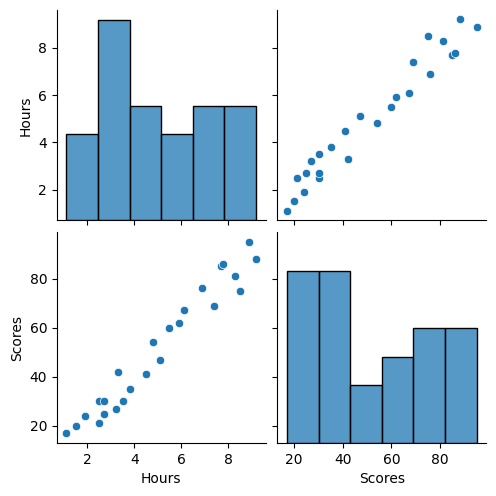
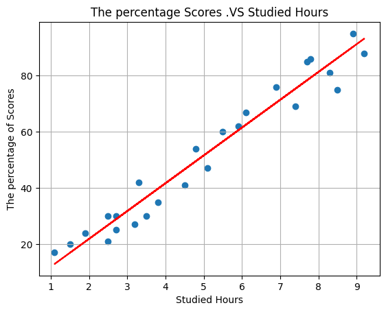

#  The Spark Foundation: Data Science And Business Analytics Tasks


## Task 1: Prediction using Supervised ML
#### Target: Predict the percentage of marks that a student is expected to score based upon the number of hours they studied. 

## Author: Ahmed Abdo Amin Abdo

## 📥 Import required libraries


```python
#!pip2 install seaborn
#!pip3 install scikit-learn
```


```python
import pandas as pd
import numpy as np  
import seaborn as sns
import matplotlib.pyplot as plt  
%matplotlib inline
from sklearn.model_selection import train_test_split 
from sklearn.linear_model import LinearRegression 
from sklearn import metrics
```

## 🗃️ Load Dataset from remote link


```python
# Reading data from remote link
urlData = "http://bit.ly/w-data"
studentData = pd.read_csv(urlData)
print("Data imported successfully")

studentData.head(10)
```

    Data imported successfully
    


<div>
<style scoped>
    .dataframe tbody tr th:only-of-type {
        vertical-align: middle;
    }

    .dataframe tbody tr th {
        vertical-align: top;
    }

    .dataframe thead th {
        text-align: right;
    }
</style>
<table border="1" class="dataframe">
  <thead>
    <tr style="text-align: right;">
      <th></th>
      <th>Hours</th>
      <th>Scores</th>
    </tr>
  </thead>
  <tbody>
    <tr>
      <th>0</th>
      <td>2.5</td>
      <td>21</td>
    </tr>
    <tr>
      <th>1</th>
      <td>5.1</td>
      <td>47</td>
    </tr>
    <tr>
      <th>2</th>
      <td>3.2</td>
      <td>27</td>
    </tr>
    <tr>
      <th>3</th>
      <td>8.5</td>
      <td>75</td>
    </tr>
    <tr>
      <th>4</th>
      <td>3.5</td>
      <td>30</td>
    </tr>
    <tr>
      <th>5</th>
      <td>1.5</td>
      <td>20</td>
    </tr>
    <tr>
      <th>6</th>
      <td>9.2</td>
      <td>88</td>
    </tr>
    <tr>
      <th>7</th>
      <td>5.5</td>
      <td>60</td>
    </tr>
    <tr>
      <th>8</th>
      <td>8.3</td>
      <td>81</td>
    </tr>
    <tr>
      <th>9</th>
      <td>2.7</td>
      <td>25</td>
    </tr>
  </tbody>
</table>
</div>


## 📝 Meta information of Dataframe


```python
studentData.info()
```

    <class 'pandas.core.frame.DataFrame'>
    RangeIndex: 25 entries, 0 to 24
    Data columns (total 2 columns):
     #   Column  Non-Null Count  Dtype  
    ---  ------  --------------  -----  
     0   Hours   25 non-null     float64
     1   Scores  25 non-null     int64  
    dtypes: float64(1), int64(1)
    memory usage: 528.0 bytes
    

##  Show Statistical Analysis


```python
studentData.describe()
```


<div>
<style scoped>
    .dataframe tbody tr th:only-of-type {
        vertical-align: middle;
    }

    .dataframe tbody tr th {
        vertical-align: top;
    }

    .dataframe thead th {
        text-align: right;
    }
</style>
<table border="1" class="dataframe">
  <thead>
    <tr style="text-align: right;">
      <th></th>
      <th>Hours</th>
      <th>Scores</th>
    </tr>
  </thead>
  <tbody>
    <tr>
      <th>count</th>
      <td>25.000000</td>
      <td>25.000000</td>
    </tr>
    <tr>
      <th>mean</th>
      <td>5.012000</td>
      <td>51.480000</td>
    </tr>
    <tr>
      <th>std</th>
      <td>2.525094</td>
      <td>25.286887</td>
    </tr>
    <tr>
      <th>min</th>
      <td>1.100000</td>
      <td>17.000000</td>
    </tr>
    <tr>
      <th>25%</th>
      <td>2.700000</td>
      <td>30.000000</td>
    </tr>
    <tr>
      <th>50%</th>
      <td>4.800000</td>
      <td>47.000000</td>
    </tr>
    <tr>
      <th>75%</th>
      <td>7.400000</td>
      <td>75.000000</td>
    </tr>
    <tr>
      <th>max</th>
      <td>9.200000</td>
      <td>95.000000</td>
    </tr>
  </tbody>
</table>
</div>


```python
studentData.corr()
```


<div>
<style scoped>
    .dataframe tbody tr th:only-of-type {
        vertical-align: middle;
    }

    .dataframe tbody tr th {
        vertical-align: top;
    }

    .dataframe thead th {
        text-align: right;
    }
</style>
<table border="1" class="dataframe">
  <thead>
    <tr style="text-align: right;">
      <th></th>
      <th>Hours</th>
      <th>Scores</th>
    </tr>
  </thead>
  <tbody>
    <tr>
      <th>Hours</th>
      <td>1.000000</td>
      <td>0.976191</td>
    </tr>
    <tr>
      <th>Scores</th>
      <td>0.976191</td>
      <td>1.000000</td>
    </tr>
  </tbody>
</table>
</div>


## 🔎 Check NaN values


```python
studentData.isnull().sum()
```


    Hours     0
    Scores    0
    dtype: int64


##   Visualize The data


```python
sns.pairplot(studentData)
```


    <seaborn.axisgrid.PairGrid at 0x1988bd38760>


    

    


## ✂️ Train & Test Split


```python
# Divide the data into "attributes" (inputs => X) and "labels" (outputs => y).
X = studentData.iloc[:, :-1].values  
y = studentData.iloc[:, 1].values
# Split this data (X, y) into training and test sets.
X_train, X_test, y_train, y_test = train_test_split(X, y, 
                            test_size=0.2, random_state=0) 
```

##   Train Regression Model


```python
regressor = LinearRegression()  
regressor.fit(X_train, y_train)
print("Training complete.")
```

    Training complete.
    

## Visualize The Model


```python
# Plotting the regression line
line = regressor.coef_*X+regressor.intercept_

# Plotting for the test data
plt.scatter(X, y,  label='Sample data')
plt.plot(X, line, label='Regression model', color='red')
plt.xlabel("Studied Hours")
plt.ylabel("The percentage of Scores")
plt.title("The percentage Scores .VS Studied Hours")
plt.grid()
plt.show()
```


    

    


## Make Predictions


```python
# Predicting the scores
y_pred = regressor.predict(X_test) 
# Comparing Actual vs Predicted
df = pd.DataFrame({'Actual (%)': y_test, 'Predicted (%)': y_pred})  
df
```


<div>
<style scoped>
    .dataframe tbody tr th:only-of-type {
        vertical-align: middle;
    }

    .dataframe tbody tr th {
        vertical-align: top;
    }

    .dataframe thead th {
        text-align: right;
    }
</style>
<table border="1" class="dataframe">
  <thead>
    <tr style="text-align: right;">
      <th></th>
      <th>Actual (%)</th>
      <th>Predicted (%)</th>
    </tr>
  </thead>
  <tbody>
    <tr>
      <th>0</th>
      <td>20</td>
      <td>16.884145</td>
    </tr>
    <tr>
      <th>1</th>
      <td>27</td>
      <td>33.732261</td>
    </tr>
    <tr>
      <th>2</th>
      <td>69</td>
      <td>75.357018</td>
    </tr>
    <tr>
      <th>3</th>
      <td>30</td>
      <td>26.794801</td>
    </tr>
    <tr>
      <th>4</th>
      <td>62</td>
      <td>60.491033</td>
    </tr>
  </tbody>
</table>
</div>


##  Question: What will be predicted score if a student studies for 9.25 hrs/ day?


```python
hours = 9.25
own_pred = regressor.predict([[hours]])
print(f"If a student studies for {hours} hrs/ day, his score will be {own_pred[0]}%")
```

    If a student studies for 9.25 hrs/ day, his score will be 93.69173248737535%
    

## Evaluate The Model


```python
print(f'Mean Absolute Error:{metrics.mean_absolute_error(y_test, y_pred)}') 
print(f'Mean Squared Error:{metrics.mean_squared_error(y_test, y_pred)}')
```

    Mean Absolute Error:4.183859899002975
    Mean Squared Error:21.598769307217406
    


```python

```
