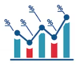
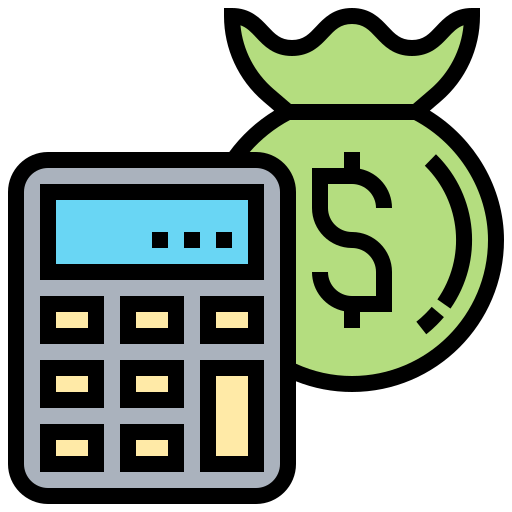
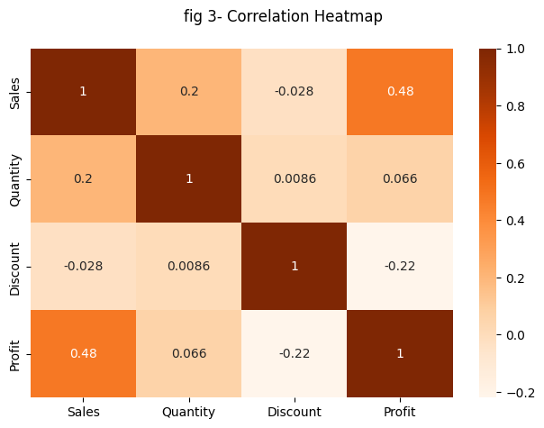

# The Spark Foundation: Data Science And Business Analytics Tasks


## Task 3: Exploratory Data Analysis - Retail


###  Target : find out the weak areas where you can work to make more profit.


## Author: Ahmed Abdo Amin Abdo

#  Business  Value

### Perform Exploratory Data Analysis (EDA) on dataset ‘SampleSuperstore as business manager, discover the weak areas of the sales deparment in order to improve the sales.

This task will extract information. Appropriate preprocessing will be conducted, followed by data investigation. The primary attention will be on profit-related factors, which are the attributes 'Sales' and 'Profit' in American Dollars (USD) measures, as well as the integer value of 'Quantity' and percentage values of 'Discount' for each sales transaction. Analyzing them will aid in identifying and assessing problem areas.

#  Data Preparation

##  Data Limitation

<strong>
    
1. As there is no date information in the sales data, time series analysis is not possible. This enables us to research how various times affect particular recorded data.
    
2. There is no meta information in the sales.
    
3. Additionally, we are unable to verify that the sample data is bias-free and representative of the dataset as a whole.
    
</strong>

##  Data Organisation

The Data is available in CSV document. Recording all the 'Sales' and 'Profit' data in each rows. The data is considered long since every row registers single "sub-category" sales record in a single row meaning the subject will have data records in muliple row for each time of sales

<strong> Glimps of Document </strong>


|DatasetName|Type|Description|
|-:|-:|-:|
|SampleSuperstore|Microsoft Excel CSV|Contains all records of sales nessasry for this EDA|

#  Data Process

## 📥 Import required libraries


```python
#!pip2 install seaborn
#!pip3 install scikit-learn
#!pip3 install yellowbrick
#!pip3 install plotly
```


```python
import pandas as pd
import numpy as np  
import seaborn as sns
import matplotlib.pyplot as plt  
%matplotlib inline
from sklearn.metrics import silhouette_score
import warnings
warnings.filterwarnings('ignore')
import plotly.express as px
from plotly.subplots import make_subplots
import plotly.graph_objects as go
```

## 🗃️ Load Dataset


```python
# Reading data
urlData = "./SampleSuperstore.csv"
SampleSuperstoreData = pd.read_csv(urlData)
print("Data imported successfully")

SampleSuperstoreData.head(10)
```

    Data imported successfully
    


<div>
<style scoped>
    .dataframe tbody tr th:only-of-type {
        vertical-align: middle;
    }

    .dataframe tbody tr th {
        vertical-align: top;
    }

    .dataframe thead th {
        text-align: right;
    }
</style>
<table border="1" class="dataframe">
  <thead>
    <tr style="text-align: right;">
      <th></th>
      <th>Ship Mode</th>
      <th>Segment</th>
      <th>Country</th>
      <th>City</th>
      <th>State</th>
      <th>Postal Code</th>
      <th>Region</th>
      <th>Category</th>
      <th>Sub-Category</th>
      <th>Sales</th>
      <th>Quantity</th>
      <th>Discount</th>
      <th>Profit</th>
    </tr>
  </thead>
  <tbody>
    <tr>
      <th>0</th>
      <td>Second Class</td>
      <td>Consumer</td>
      <td>United States</td>
      <td>Henderson</td>
      <td>Kentucky</td>
      <td>42420</td>
      <td>South</td>
      <td>Furniture</td>
      <td>Bookcases</td>
      <td>261.9600</td>
      <td>2</td>
      <td>0.00</td>
      <td>41.9136</td>
    </tr>
    <tr>
      <th>1</th>
      <td>Second Class</td>
      <td>Consumer</td>
      <td>United States</td>
      <td>Henderson</td>
      <td>Kentucky</td>
      <td>42420</td>
      <td>South</td>
      <td>Furniture</td>
      <td>Chairs</td>
      <td>731.9400</td>
      <td>3</td>
      <td>0.00</td>
      <td>219.5820</td>
    </tr>
    <tr>
      <th>2</th>
      <td>Second Class</td>
      <td>Corporate</td>
      <td>United States</td>
      <td>Los Angeles</td>
      <td>California</td>
      <td>90036</td>
      <td>West</td>
      <td>Office Supplies</td>
      <td>Labels</td>
      <td>14.6200</td>
      <td>2</td>
      <td>0.00</td>
      <td>6.8714</td>
    </tr>
    <tr>
      <th>3</th>
      <td>Standard Class</td>
      <td>Consumer</td>
      <td>United States</td>
      <td>Fort Lauderdale</td>
      <td>Florida</td>
      <td>33311</td>
      <td>South</td>
      <td>Furniture</td>
      <td>Tables</td>
      <td>957.5775</td>
      <td>5</td>
      <td>0.45</td>
      <td>-383.0310</td>
    </tr>
    <tr>
      <th>4</th>
      <td>Standard Class</td>
      <td>Consumer</td>
      <td>United States</td>
      <td>Fort Lauderdale</td>
      <td>Florida</td>
      <td>33311</td>
      <td>South</td>
      <td>Office Supplies</td>
      <td>Storage</td>
      <td>22.3680</td>
      <td>2</td>
      <td>0.20</td>
      <td>2.5164</td>
    </tr>
    <tr>
      <th>5</th>
      <td>Standard Class</td>
      <td>Consumer</td>
      <td>United States</td>
      <td>Los Angeles</td>
      <td>California</td>
      <td>90032</td>
      <td>West</td>
      <td>Furniture</td>
      <td>Furnishings</td>
      <td>48.8600</td>
      <td>7</td>
      <td>0.00</td>
      <td>14.1694</td>
    </tr>
    <tr>
      <th>6</th>
      <td>Standard Class</td>
      <td>Consumer</td>
      <td>United States</td>
      <td>Los Angeles</td>
      <td>California</td>
      <td>90032</td>
      <td>West</td>
      <td>Office Supplies</td>
      <td>Art</td>
      <td>7.2800</td>
      <td>4</td>
      <td>0.00</td>
      <td>1.9656</td>
    </tr>
    <tr>
      <th>7</th>
      <td>Standard Class</td>
      <td>Consumer</td>
      <td>United States</td>
      <td>Los Angeles</td>
      <td>California</td>
      <td>90032</td>
      <td>West</td>
      <td>Technology</td>
      <td>Phones</td>
      <td>907.1520</td>
      <td>6</td>
      <td>0.20</td>
      <td>90.7152</td>
    </tr>
    <tr>
      <th>8</th>
      <td>Standard Class</td>
      <td>Consumer</td>
      <td>United States</td>
      <td>Los Angeles</td>
      <td>California</td>
      <td>90032</td>
      <td>West</td>
      <td>Office Supplies</td>
      <td>Binders</td>
      <td>18.5040</td>
      <td>3</td>
      <td>0.20</td>
      <td>5.7825</td>
    </tr>
    <tr>
      <th>9</th>
      <td>Standard Class</td>
      <td>Consumer</td>
      <td>United States</td>
      <td>Los Angeles</td>
      <td>California</td>
      <td>90032</td>
      <td>West</td>
      <td>Office Supplies</td>
      <td>Appliances</td>
      <td>114.9000</td>
      <td>5</td>
      <td>0.00</td>
      <td>34.4700</td>
    </tr>
  </tbody>
</table>
</div>


## 🔎 Check NaN values


```python
SampleSuperstoreData.isnull().sum(axis = 0).to_frame()
```


<div>
<style scoped>
    .dataframe tbody tr th:only-of-type {
        vertical-align: middle;
    }

    .dataframe tbody tr th {
        vertical-align: top;
    }

    .dataframe thead th {
        text-align: right;
    }
</style>
<table border="1" class="dataframe">
  <thead>
    <tr style="text-align: right;">
      <th></th>
      <th>0</th>
    </tr>
  </thead>
  <tbody>
    <tr>
      <th>Ship Mode</th>
      <td>0</td>
    </tr>
    <tr>
      <th>Segment</th>
      <td>0</td>
    </tr>
    <tr>
      <th>Country</th>
      <td>0</td>
    </tr>
    <tr>
      <th>City</th>
      <td>0</td>
    </tr>
    <tr>
      <th>State</th>
      <td>0</td>
    </tr>
    <tr>
      <th>Postal Code</th>
      <td>0</td>
    </tr>
    <tr>
      <th>Region</th>
      <td>0</td>
    </tr>
    <tr>
      <th>Category</th>
      <td>0</td>
    </tr>
    <tr>
      <th>Sub-Category</th>
      <td>0</td>
    </tr>
    <tr>
      <th>Sales</th>
      <td>0</td>
    </tr>
    <tr>
      <th>Quantity</th>
      <td>0</td>
    </tr>
    <tr>
      <th>Discount</th>
      <td>0</td>
    </tr>
    <tr>
      <th>Profit</th>
      <td>0</td>
    </tr>
  </tbody>
</table>
</div>


## 📝 Meta information of Dataframe


```python
SampleSuperstoreData.info()
```

    <class 'pandas.core.frame.DataFrame'>
    RangeIndex: 9994 entries, 0 to 9993
    Data columns (total 13 columns):
     #   Column        Non-Null Count  Dtype  
    ---  ------        --------------  -----  
     0   Ship Mode     9994 non-null   object 
     1   Segment       9994 non-null   object 
     2   Country       9994 non-null   object 
     3   City          9994 non-null   object 
     4   State         9994 non-null   object 
     5   Postal Code   9994 non-null   int64  
     6   Region        9994 non-null   object 
     7   Category      9994 non-null   object 
     8   Sub-Category  9994 non-null   object 
     9   Sales         9994 non-null   float64
     10  Quantity      9994 non-null   int64  
     11  Discount      9994 non-null   float64
     12  Profit        9994 non-null   float64
    dtypes: float64(3), int64(2), object(8)
    memory usage: 1015.1+ KB
    

### The dataset has 9994 rows of records and 13 columns of attributes. 
The attribute data types are 8 qualitative discrete categorical(Objects/Strings), 2 quantitative discrete numerical integer, and 3 quantitative continuous numerical float.

##  Show Statistical Analysis

Some outliers represent natural variations in the population, and they should be left as is in our dataset. These are called true outliers. Other outliers are problematic and should be removed because they represent measurement errors, data entry or processing errors, or poor sampling. we will be using Turkey's Methord for finding outliers. Turkey's method is a mathematical method to find outliers. As per the Turkey method, the outliers are the points lying beyond the upper boundary of Q3 +1.5 IQR and the lower boundary of Q1 - 1.5 IQR. These boundaries are referred to as outlier fences.

>As our dataframe is really small having outliers in our dataset will greatly skew the results and it is nessasry to treat them 


We will be using Panda's ".describe()" methord to get the overview of our data's numrical diversity and also plot chart to visualise them


```python
SampleSuperstoreData.describe()
```


<div>
<style scoped>
    .dataframe tbody tr th:only-of-type {
        vertical-align: middle;
    }

    .dataframe tbody tr th {
        vertical-align: top;
    }

    .dataframe thead th {
        text-align: right;
    }
</style>
<table border="1" class="dataframe">
  <thead>
    <tr style="text-align: right;">
      <th></th>
      <th>Postal Code</th>
      <th>Sales</th>
      <th>Quantity</th>
      <th>Discount</th>
      <th>Profit</th>
    </tr>
  </thead>
  <tbody>
    <tr>
      <th>count</th>
      <td>9994.000000</td>
      <td>9994.000000</td>
      <td>9994.000000</td>
      <td>9994.000000</td>
      <td>9994.000000</td>
    </tr>
    <tr>
      <th>mean</th>
      <td>55190.379428</td>
      <td>229.858001</td>
      <td>3.789574</td>
      <td>0.156203</td>
      <td>28.656896</td>
    </tr>
    <tr>
      <th>std</th>
      <td>32063.693350</td>
      <td>623.245101</td>
      <td>2.225110</td>
      <td>0.206452</td>
      <td>234.260108</td>
    </tr>
    <tr>
      <th>min</th>
      <td>1040.000000</td>
      <td>0.444000</td>
      <td>1.000000</td>
      <td>0.000000</td>
      <td>-6599.978000</td>
    </tr>
    <tr>
      <th>25%</th>
      <td>23223.000000</td>
      <td>17.280000</td>
      <td>2.000000</td>
      <td>0.000000</td>
      <td>1.728750</td>
    </tr>
    <tr>
      <th>50%</th>
      <td>56430.500000</td>
      <td>54.490000</td>
      <td>3.000000</td>
      <td>0.200000</td>
      <td>8.666500</td>
    </tr>
    <tr>
      <th>75%</th>
      <td>90008.000000</td>
      <td>209.940000</td>
      <td>5.000000</td>
      <td>0.200000</td>
      <td>29.364000</td>
    </tr>
    <tr>
      <th>max</th>
      <td>99301.000000</td>
      <td>22638.480000</td>
      <td>14.000000</td>
      <td>0.800000</td>
      <td>8399.976000</td>
    </tr>
  </tbody>
</table>
</div>


There certainly are many things going on as such, We clearly see that in "Profit" column Max point and minimum point of our data is vast apart and same goes for "Sales" and "Quantity" Column Lets apply our Turkey's Methodology for understanding the fence for outliers stands in our dataset.


```python
# calculate IQR for Training Set
IQR1_data = SampleSuperstoreData.quantile(0.25)
IQR3_data = SampleSuperstoreData.quantile(0.75)

IQR_data = IQR3_data - IQR1_data

print("Number of possible outliers per feature")
print(((SampleSuperstoreData < (IQR_data - 1.5 * IQR_data)) | (SampleSuperstoreData > (IQR3_data + 1.5 * IQR_data))).sum())
```

    Number of possible outliers per feature
    Category           0
    City               0
    Country            0
    Discount         856
    Postal Code        0
    Profit          2344
    Quantity         170
    Region             0
    Sales           1167
    Segment            0
    Ship Mode          0
    State              0
    Sub-Category       0
    dtype: int64
    

Some outliers represents natural variations in the population, and they should be left as is in your dataset. These are called true outliers. Other outliers are problematic and should be removed because they represent measurement errors, data entry or processing errors, or poor sampling.

As its not made clear in our meta, that the dataset is not representive of its dataset we would assume that the data is showcasing natrual variations and are true outliers.

# Data Cleaning

##  Data Reduction
Dropping the variable 'Country' via attribute dimensionality reduction, because it contains 100% identical values of "United States" for all records. 'Postal Code' as we wont be using it in our data analysis as we also have the variabl e of "citys"


```python
clean_data=SampleSuperstoreData.drop(['Country','Postal Code'], axis=1)
```

##  Data Reduication
Duplicated rows or records can now by dropped from the dataset, as this redundancy may cause inaccurate results and outcomes (an assumption on the dataset).


```python
print(f"Number of duplicate recocrds present in the dataset = {clean_data.duplicated().sum()}")
```

    Number of duplicate recocrds present in the dataset = 50
    

##  Unit Price & Profit Calculation
we will now add two new Feature/Columns to our dataset that shows the price of "per item" and amount profit/loss made on that item


```python
# Unit Price calculation
clean_data['Unit Price'] = clean_data.Sales / clean_data.Quantity

# Unit Profit calculation
clean_data['Unit Profit'] = clean_data.Profit / clean_data.Quantity
```

##  Cleaned Data Preview 


```python
display(clean_data)
```


<div>
<style scoped>
    .dataframe tbody tr th:only-of-type {
        vertical-align: middle;
    }

    .dataframe tbody tr th {
        vertical-align: top;
    }

    .dataframe thead th {
        text-align: right;
    }
</style>
<table border="1" class="dataframe">
  <thead>
    <tr style="text-align: right;">
      <th></th>
      <th>Ship Mode</th>
      <th>Segment</th>
      <th>City</th>
      <th>State</th>
      <th>Region</th>
      <th>Category</th>
      <th>Sub-Category</th>
      <th>Sales</th>
      <th>Quantity</th>
      <th>Discount</th>
      <th>Profit</th>
      <th>Unit Price</th>
      <th>Unit Profit</th>
    </tr>
  </thead>
  <tbody>
    <tr>
      <th>0</th>
      <td>Second Class</td>
      <td>Consumer</td>
      <td>Henderson</td>
      <td>Kentucky</td>
      <td>South</td>
      <td>Furniture</td>
      <td>Bookcases</td>
      <td>261.9600</td>
      <td>2</td>
      <td>0.00</td>
      <td>41.9136</td>
      <td>130.9800</td>
      <td>20.9568</td>
    </tr>
    <tr>
      <th>1</th>
      <td>Second Class</td>
      <td>Consumer</td>
      <td>Henderson</td>
      <td>Kentucky</td>
      <td>South</td>
      <td>Furniture</td>
      <td>Chairs</td>
      <td>731.9400</td>
      <td>3</td>
      <td>0.00</td>
      <td>219.5820</td>
      <td>243.9800</td>
      <td>73.1940</td>
    </tr>
    <tr>
      <th>2</th>
      <td>Second Class</td>
      <td>Corporate</td>
      <td>Los Angeles</td>
      <td>California</td>
      <td>West</td>
      <td>Office Supplies</td>
      <td>Labels</td>
      <td>14.6200</td>
      <td>2</td>
      <td>0.00</td>
      <td>6.8714</td>
      <td>7.3100</td>
      <td>3.4357</td>
    </tr>
    <tr>
      <th>3</th>
      <td>Standard Class</td>
      <td>Consumer</td>
      <td>Fort Lauderdale</td>
      <td>Florida</td>
      <td>South</td>
      <td>Furniture</td>
      <td>Tables</td>
      <td>957.5775</td>
      <td>5</td>
      <td>0.45</td>
      <td>-383.0310</td>
      <td>191.5155</td>
      <td>-76.6062</td>
    </tr>
    <tr>
      <th>4</th>
      <td>Standard Class</td>
      <td>Consumer</td>
      <td>Fort Lauderdale</td>
      <td>Florida</td>
      <td>South</td>
      <td>Office Supplies</td>
      <td>Storage</td>
      <td>22.3680</td>
      <td>2</td>
      <td>0.20</td>
      <td>2.5164</td>
      <td>11.1840</td>
      <td>1.2582</td>
    </tr>
    <tr>
      <th>...</th>
      <td>...</td>
      <td>...</td>
      <td>...</td>
      <td>...</td>
      <td>...</td>
      <td>...</td>
      <td>...</td>
      <td>...</td>
      <td>...</td>
      <td>...</td>
      <td>...</td>
      <td>...</td>
      <td>...</td>
    </tr>
    <tr>
      <th>9989</th>
      <td>Second Class</td>
      <td>Consumer</td>
      <td>Miami</td>
      <td>Florida</td>
      <td>South</td>
      <td>Furniture</td>
      <td>Furnishings</td>
      <td>25.2480</td>
      <td>3</td>
      <td>0.20</td>
      <td>4.1028</td>
      <td>8.4160</td>
      <td>1.3676</td>
    </tr>
    <tr>
      <th>9990</th>
      <td>Standard Class</td>
      <td>Consumer</td>
      <td>Costa Mesa</td>
      <td>California</td>
      <td>West</td>
      <td>Furniture</td>
      <td>Furnishings</td>
      <td>91.9600</td>
      <td>2</td>
      <td>0.00</td>
      <td>15.6332</td>
      <td>45.9800</td>
      <td>7.8166</td>
    </tr>
    <tr>
      <th>9991</th>
      <td>Standard Class</td>
      <td>Consumer</td>
      <td>Costa Mesa</td>
      <td>California</td>
      <td>West</td>
      <td>Technology</td>
      <td>Phones</td>
      <td>258.5760</td>
      <td>2</td>
      <td>0.20</td>
      <td>19.3932</td>
      <td>129.2880</td>
      <td>9.6966</td>
    </tr>
    <tr>
      <th>9992</th>
      <td>Standard Class</td>
      <td>Consumer</td>
      <td>Costa Mesa</td>
      <td>California</td>
      <td>West</td>
      <td>Office Supplies</td>
      <td>Paper</td>
      <td>29.6000</td>
      <td>4</td>
      <td>0.00</td>
      <td>13.3200</td>
      <td>7.4000</td>
      <td>3.3300</td>
    </tr>
    <tr>
      <th>9993</th>
      <td>Second Class</td>
      <td>Consumer</td>
      <td>Westminster</td>
      <td>California</td>
      <td>West</td>
      <td>Office Supplies</td>
      <td>Appliances</td>
      <td>243.1600</td>
      <td>2</td>
      <td>0.00</td>
      <td>72.9480</td>
      <td>121.5800</td>
      <td>36.4740</td>
    </tr>
  </tbody>
</table>
<p>9994 rows × 13 columns</p>
</div>


#  Data Analysis

##  Data Exploration


```python
clean_data.describe(include="all")
```


<div>
<style scoped>
    .dataframe tbody tr th:only-of-type {
        vertical-align: middle;
    }

    .dataframe tbody tr th {
        vertical-align: top;
    }

    .dataframe thead th {
        text-align: right;
    }
</style>
<table border="1" class="dataframe">
  <thead>
    <tr style="text-align: right;">
      <th></th>
      <th>Ship Mode</th>
      <th>Segment</th>
      <th>City</th>
      <th>State</th>
      <th>Region</th>
      <th>Category</th>
      <th>Sub-Category</th>
      <th>Sales</th>
      <th>Quantity</th>
      <th>Discount</th>
      <th>Profit</th>
      <th>Unit Price</th>
      <th>Unit Profit</th>
    </tr>
  </thead>
  <tbody>
    <tr>
      <th>count</th>
      <td>9994</td>
      <td>9994</td>
      <td>9994</td>
      <td>9994</td>
      <td>9994</td>
      <td>9994</td>
      <td>9994</td>
      <td>9994.000000</td>
      <td>9994.000000</td>
      <td>9994.000000</td>
      <td>9994.000000</td>
      <td>9994.000000</td>
      <td>9994.000000</td>
    </tr>
    <tr>
      <th>unique</th>
      <td>4</td>
      <td>3</td>
      <td>531</td>
      <td>49</td>
      <td>4</td>
      <td>3</td>
      <td>17</td>
      <td>NaN</td>
      <td>NaN</td>
      <td>NaN</td>
      <td>NaN</td>
      <td>NaN</td>
      <td>NaN</td>
    </tr>
    <tr>
      <th>top</th>
      <td>Standard Class</td>
      <td>Consumer</td>
      <td>New York City</td>
      <td>California</td>
      <td>West</td>
      <td>Office Supplies</td>
      <td>Binders</td>
      <td>NaN</td>
      <td>NaN</td>
      <td>NaN</td>
      <td>NaN</td>
      <td>NaN</td>
      <td>NaN</td>
    </tr>
    <tr>
      <th>freq</th>
      <td>5968</td>
      <td>5191</td>
      <td>915</td>
      <td>2001</td>
      <td>3203</td>
      <td>6026</td>
      <td>1523</td>
      <td>NaN</td>
      <td>NaN</td>
      <td>NaN</td>
      <td>NaN</td>
      <td>NaN</td>
      <td>NaN</td>
    </tr>
    <tr>
      <th>mean</th>
      <td>NaN</td>
      <td>NaN</td>
      <td>NaN</td>
      <td>NaN</td>
      <td>NaN</td>
      <td>NaN</td>
      <td>NaN</td>
      <td>229.858001</td>
      <td>3.789574</td>
      <td>0.156203</td>
      <td>28.656896</td>
      <td>60.919569</td>
      <td>7.799372</td>
    </tr>
    <tr>
      <th>std</th>
      <td>NaN</td>
      <td>NaN</td>
      <td>NaN</td>
      <td>NaN</td>
      <td>NaN</td>
      <td>NaN</td>
      <td>NaN</td>
      <td>623.245101</td>
      <td>2.225110</td>
      <td>0.206452</td>
      <td>234.260108</td>
      <td>142.927440</td>
      <td>56.074974</td>
    </tr>
    <tr>
      <th>min</th>
      <td>NaN</td>
      <td>NaN</td>
      <td>NaN</td>
      <td>NaN</td>
      <td>NaN</td>
      <td>NaN</td>
      <td>NaN</td>
      <td>0.444000</td>
      <td>1.000000</td>
      <td>0.000000</td>
      <td>-6599.978000</td>
      <td>0.336000</td>
      <td>-1319.995600</td>
    </tr>
    <tr>
      <th>25%</th>
      <td>NaN</td>
      <td>NaN</td>
      <td>NaN</td>
      <td>NaN</td>
      <td>NaN</td>
      <td>NaN</td>
      <td>NaN</td>
      <td>17.280000</td>
      <td>2.000000</td>
      <td>0.000000</td>
      <td>1.728750</td>
      <td>5.470000</td>
      <td>0.722800</td>
    </tr>
    <tr>
      <th>50%</th>
      <td>NaN</td>
      <td>NaN</td>
      <td>NaN</td>
      <td>NaN</td>
      <td>NaN</td>
      <td>NaN</td>
      <td>NaN</td>
      <td>54.490000</td>
      <td>3.000000</td>
      <td>0.200000</td>
      <td>8.666500</td>
      <td>16.270000</td>
      <td>2.767000</td>
    </tr>
    <tr>
      <th>75%</th>
      <td>NaN</td>
      <td>NaN</td>
      <td>NaN</td>
      <td>NaN</td>
      <td>NaN</td>
      <td>NaN</td>
      <td>NaN</td>
      <td>209.940000</td>
      <td>5.000000</td>
      <td>0.200000</td>
      <td>29.364000</td>
      <td>63.940000</td>
      <td>8.703200</td>
    </tr>
    <tr>
      <th>max</th>
      <td>NaN</td>
      <td>NaN</td>
      <td>NaN</td>
      <td>NaN</td>
      <td>NaN</td>
      <td>NaN</td>
      <td>NaN</td>
      <td>22638.480000</td>
      <td>14.000000</td>
      <td>0.800000</td>
      <td>8399.976000</td>
      <td>3773.080000</td>
      <td>1679.995200</td>
    </tr>
  </tbody>
</table>
</div>


There will be "NaN" in a few of the classified columns, but that's acceptable. Since categorical values are not meant to be subjected to calculations, they can be ignored.

The individual frequency and count of the category variables are of particular relevance. So let's examine the data.

#### 1. Categorical Features

> The total number of Rows is the first thing to note. As can be seen, there are 9944 rows in all.

> There are four "Ship Modes," with "Standard class" receiving orders over 5,930 times, or roughly 60% of business orders.

> There are 3 buyer segments, and more than 50% of sales came from the "Consumer" segment, which is repeated 5160 times.

> The store has seventeen Sub-Categories and three Main Product Categories. With 5,986 orders, or 58% of all records, "Office supplies" is the category that has been ordered the most. and the most popular item in the category, "Binders," received 1,518 orders, accounting for 15.2% of our dataset.

> Our data was collected from 4 regions, 49 states, and 531 cities across the United States, with the majority of orders coming from the **"West Region" (3,177), "California" (1,980) State, and "New York City" (531).

<strong> 2- Numrical Features </strong>

> According to this data, Superstore's has an average of 230.7 sales accross all records, having a minimum sales of 0.44 and maximum sales of 22,638.

> Superstore sells 3-4 quantity of items on average across all sales records, also recording its max quantity sold of 14 items

> Superstore provides a discount of 15-20% on average on all its products sold. it is also recorded of providing discounts upto 80% on occassions.

> Superstores gains a profit of 28.77USD on average on its sales. it is also recorded on facing loss as low as 6,599USD and profit as high as 8,399USD

now as we know all the basics information of our data lets see which numrical features are affexting our profits

##  How does Sales, Quantity and Discount affects SuperStores Profits?
We can check this out by ploting a heatmap showcasing the corealation between each numrical columns across we won't be including the feature we added in the dataframe for this correlation.


```python
#for easy readablity for biggners
cmap=clean_data.drop(["Unit Price","Unit Profit"],axis=1)
cmap["Profit"]=cmap["Profit"]
sns.heatmap(cmap.corr(), cmap = 'Oranges' ,annot = True)
plt.suptitle("fig 3- Correlation Heatmap")
plt.tight_layout()
```


    

    


We can clearly see that "Sales" and "Discount" have a direct impact on our "Profit," with Sales showing a positive correlation and Discount showing a negative correlation ,respectively. This is expected because as sales rise, profits rise as well, and as discounts are offered on sales, profit margins fall.

Additionally, we can see that there is a positive correlation between "Sales" and "Quantity," which also makes sense because the more quantity, the greater the amount of sales, but this correlation appears to be weak.

We can also observe that there is little to no difference in sales and quantity due to discounts, proving that the discount strategy is ineffective for certain items. As a result, Superstore needs to rethink its strategies for luring customers.


```python
fig = px.scatter(clean_data,x="Profit",y="Sales",color="Discount",
                 size="Quantity",symbol="Segment",title="How diffrent factors affects Superstore's sales ")
fig.update_layout(height=600, width=800,
                  legend=dict(yanchor="top", y=0.99, 
                              xanchor="left", x=0.01))
fig.show()

```

### Sales

- There is a Huge Disparty in the number of sales even between top 10 States As well as between Cities, The company has the highest sales in the state of California (as shown in fig. 4.1), selling over 456K USD of Total Sales, which is nearly 20% of the total sales generated by Superstore. Meanwhile, the 2nd ranking State, "New York," generates approximately 310K USD of sales. Followed by "Texas" is in third place, creating total sales of 170k USD, and "Virginia" is in tenth place, generating total sales of 70k USD.
- It is evident that California has the highest amount of overall sales even though it is not as saturated as New York. This is due to the fact that the superstore has the majority of its branches located in this state, with 81 cities having Superstores.
- Between Cities Superstore is obviously quite popular in "New York City," as evidenced by the fact that this city alone generates a total of 255k USD in sales, accounting for 82.4% of the state's overall sales.

> - The category that attracts the most sales in this city is technology. The three Items with the biggest sales in this city are "phones," "machines," and "chairs," which together account for 45% of the city's sales.

> - FUN FACT: the total sales in the state of New York is more than the sales in all of the Central America combined.

- Los Angeles, which ranks as the city with the second-highest sales contribution at the superstore, comes in second and contributes 175k USD in total sales, or 38% of California's overall sales.

> - Technology is this city's top sales sector, while phones, tables and Accessories are its top selling items.

## Profits

- California generates the most revenue for the superstore, producing a profit of 79,9k USD overall. "New York" came in second, producing a profit of 78.9K USD, then "Washington" came in third with a profit of 33,7K USD.
- One of the possible explanations for California's superior sales and profit is that it offers far smaller discounts. This shows how successful California's promotional approach of providing less discounts has been.

> - In terms of City- Superstore's most revenue is generated from "New York City" which is 65.9k USD.

> - In "New York City," the items that generate the most money from the category of technology and office supplies are "Machines", "Phones" and "Binders" which each make a profit of 14.5k USD, 10.7k USD, and 8.3k USD respectively.

> - Los Angeles, on the other hand, comes in second place with a profit of 31.4k USD. The sale of "accessories" provides the highest earnings in this city, with 5.6k, followed by "binders" and "copiers," which each make 3.7k and 3.9k.

- A considerable portion of these even experience loss, with more than half of the states making little to no profit.

## Loss

- Texas, the state with the third-highest sales, ended up costing the company the most, resulting in a loss of more than 36k USD. Ohio and Pennsylvania come next, ranking as the tenth and eighth states with the highest sales, causing the losses at about 21.7k USD and 21.6k USD, respectively.
- Additionally, All This State is among the states with the largest average discounts. providing and average discount over 35%
- (As seen in fig. 4.5) The higher the profit-to-sales ratio, the greater the profit returns received by the retailer from the state for each transaction..
- A lower value on the scales indicates that, in comparison to a state with a greater profit-to-sales ratio, the store must generate much more sales in order to generate the same amount of profit.
- States with a red tint or a profit-to-sales ratio of 1-2 indicate that they are losing more money on each transaction. The retailer can use these insights to determine which state requires more attention than the others.
